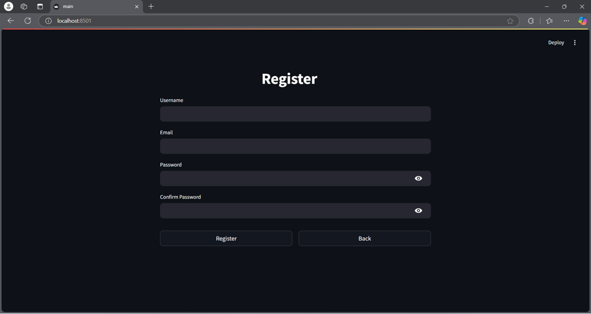

# ChequeMate: Automated Bank Cheque Processor

ChequeMate is a streamlined web application built with Streamlit that automates the process of extracting information from bank cheques in PDF format. Using Google's Gemini AI, it processes check images to extract crucial details like bank name, IFSC code, account numbers, and more.

## 🌟 Features

- **PDF Processing**: Extract cheque images from PDF documents
- **AI-Powered Extraction**: Automatically extract cheque details using Google's Gemini AI
- **Secure Authentication**: User registration and login system
- **Data Management**: Store and manage extracted check data
- **Export Capability**: Download processed data in CSV format
- **User-Friendly Interface**: Clean and intuitive Streamlit interface

## 📋 Prerequisites

- Python 3.8 or higher
- MongoDB installed and running
- Google API Key for Gemini AI

## 🛠️ Installation

1. Clone the repository:
```bash
git clone https://github.com/mohannn-sys/ChequeMate.git
cd ChequeMate
```

2. Create and activate a virtual environment:
```bash
python -m venv venv
source venv/bin/activate  # On Windows: venv\Scripts\activate
```

3. Install required packages:
```bash
pip install -r requirements.txt
```

4. Create a `.env` file in the root directory with the following variables:
```env
MONGODB_URI=your_mongodb_connection_string
API_KEY=your_google_api_key
```

## 📁 Project Structure
```
project/
├── config/               # Configuration settings
├── database/            # Database management
├── services/            # Core services and utilities
├── ui/                  # User interface components
├── requirements.txt     # Project dependencies
├── .env                # Environment variables
└── main.py             # Application entry point
```

## 🚀 Running the Application

1. Ensure MongoDB is running on your system

2. Start the application:
```bash
streamlit run main.py
```

3. Open your browser and navigate to the URL shown in the terminal (typically http://localhost:8501

These are the snapshots of the application





## 💻 Usage

1. **Registration/Login**
   - Create a new account or login with existing credentials
   - Password requirements:
     - Minimum 8 characters
     - At least one uppercase letter
     - At least one lowercase letter
     - At least one number
     - At least one special character

2. **Processing Checks**
   - Upload a PDF containing cheque images
   - Click "Process Checks" to extract information
   - View extracted data in the table format
   - Download results as CSV file

3. **Data Management**
   - View processed cheque data
   - Clear all processed data
   - Export data to CSV format

## 🔒 Security Features

- Password hashing using SHA-256
- Email validation
- Secure session management
- Environment variable protection for sensitive data

## 📊 Extracted Check Information

The application extracts the following details from each cheque:
- Bank name
- Branch name
- IFSC code
- MICR code
- Account number
- Payee name
- Date
- Amount in words
- Amount in figures

## 🔧 Configuration

Configure application settings in `config/settings.py`:
- MongoDB connection
- Google API settings
- Directory paths
- Extraction prompts

## ⚠️ Error Handling

The application includes comprehensive error handling for:
- PDF processing errors
- Image extraction issues
- Database connection problems
- Invalid user inputs
- AI processing failures

## 🤝 Contributing

1. Fork the repository
2. Create a new branch (`git checkout -b feature/improvement`)
3. Commit your changes (`git commit -am 'Add new feature'`)
4. Push to the branch (`git push origin feature/improvement`)
5. Create a Pull Request

## 📝 License

This project is licensed under the MIT License - see the LICENSE file for details.

## 👨‍💻 Author

**Mohan Kumar**

## 🙏 Acknowledgments

- Google Gemini AI for check processing
- Streamlit for the web interface
- MongoDB for data storage
- PyMuPDF for PDF processing

## 📞 Support

For support or questions, please open an issue in the GitHub repository
